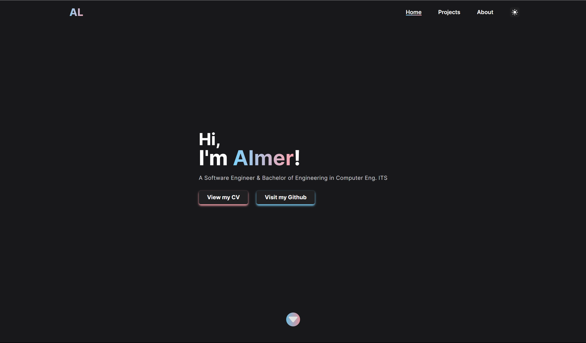

# Personal Portfolio Web

An evergrowing porfolio website made for a hands-on learning experience for Sanity.io as Content Management System (CMS) and Typescript. Here is where I will document projects I have made, I'm making, or will be making in the future.

Tech Stack:
- Typescript
- Next.js 13
- Sanity.io
- GROQ (GraphQL)
- TailwindCSS

TODOs:
- [ ] Finalize individual Project blogs
- [ ] Add three.js to the main page 
- [ ] Finalize front-end design
- [x] ~~Create Projects app~~
- [x] ~~Installed Next.js~~
- [x] ~~Installed Sanity.io~~
- [x] ~~Integrating Sanity.io into Next.js~~
- [x] ~~Add at least one Sanity schema~~
- [x] ~~Setup at least one Sanity type~~
- [x] ~~Setup TailwindCSS~~
- [x] ~~Create Hero Section~~
- [x] ~~Create Project Section~~
- [x] ~~Deployment to Vercel~~
- [x] ~~Create Navbar~~
- [x] ~~Create Footer~~
- [x] ~~Create Experience Section~~
- [x] ~~Create Profile Schema~~
- [x] ~~Create About app~~
- [x] ~~Add Darkmode~~
- [x] ~~Add project's content in Project Schema~~
- [x] ~~Seperate currated & overall projects~~
- [x] Add project tags to Sanity schema
